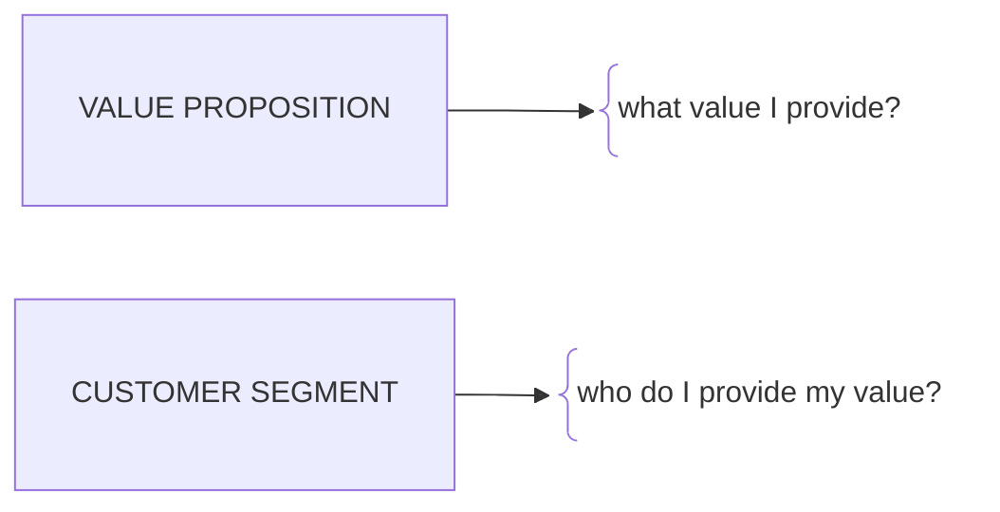

> Most important thing in business is leverage.

If your aim is to earn quick money, it is far easier to be hired to do a job. 

But it is far more fun to build something of your own even if it fails.

To earn money, you have to convince someone to pay you. Everything else is a tool for negotiation.

This is a summary of things I have learned about business as an entrepreneur/engineer. Still learning.

# Summary and Outline

- Mentality
- Skills and Knowledge
- Network
- Canvas
- Funnels
- Trust
- Demand and Supply

<MediaContainer
  src="/portfolio/photos/photo1.jpg"
  alt="Replace with a photo from your early building days"
/>

## My Goal in persuing Entrepreneurship

- Build growingsystems that I can grow and earn money from
- Build products
- Building a customer base
- See the impact of my work
- Reach my full potential

---

## The Three Pieces

When I am learning a skill. I would like to think in atomic pieces. What are the fundamental components that must be understood and mastered individually before the whole system can function effectively?

Bellow are the 3 pieces of the entrepreneurship skill. There might be more in the future as a experince more failures.

- Product (Value Proposition)
- Marketing & Sales (Customer Acquisition)
- Supply & Demand (Economy)

I learned them in exactly that order — and I learned each one because the previous one wasn't enough.

_Inspiration: frame this as three chapters of the same mistake — each time I thought I'd found "the answer," and each time reality showed me the next missing piece._

---

## Chapter 1 — Value

My first guide was the **Business Model Canvas** (Strategyzer). I focused on two blocks of it:




_Write about: which project this was, how many hours went into the canvas, how confident you felt._

**The lie I believed:** _"If the value proposition is strong enough, customers will find it."_

<MediaContainer
  src="/portfolio/photos/photo2.jpg"
  alt="Replace with a screenshot of one of your business model canvases"
/>

**The result:** the product was good. Nobody knew it existed. My projects never actually reached the customer segments I had so carefully described.

_Inspiration: end this section with the exact moment you realized "good" and "known" are unrelated variables._

---

## Chapter 2 — Marketing and Sales (Customer Acquisition)

Main Thing about dijital marketing is understanding **funnels**.

Funnel is a procces that has multiple steps that ends up with a conversion.
But it can be any user journey with steps.

```text
   Awareness   ██████████████████████   1000
   Interest    ████████████              420
   Desire      ████                      110
   Action      █                          12
```


> At the start of the journey you have **awareness** — people knowing that your product or service exists.

> At the end of the journey you have **action** — people taking the desired step.

In between steps are useally there as a design. And at each step you lose some potential customers. In between steps are there because the subject is not ready to take the next step.

You might need to build some trust between you and your potential client before you can make them take certain actions.

Action we useally we want them to take is to convert from a potential customer to an actual customer. Which is called a **conversion**."

Above chart shows that if we show our service to 1000 people 110 will desire it and 12 will buy it.

Conversion rates between steps are valuble insight points. They tell you where you lose the client.

Forexample if awareness is low, it is useless you keep polishing your product.

You can essentialy think of each client acquisition as a funnel. They meet you, they spend time with you, they learn about you, they trust you, they take interest in your services
and finally **they convert**.


### Lean Startup

The Lean Startup methodology emphasizes building a **minimum viable product (MVP)**, The goal is to quickly validate assumptions about your product, market, and customers, minimizing wasted effort and resources.

From what I see building a funnel is the most crutial part of the MVP. You need awereness first, product later.

You need to know if your audiance desires you. Estimate your spending. Analyze your KPI's and iterate accordingly.

### Sales

Sales is also a funnel. And most of the time it is a numbers game.

- Listen
- Understand
- Communicate
- Close

Do not trust sales people.

Do not trust people without proof.

Always be willing to walk away.

Trust is a spendable asset. It lowers time(value) spent on the evaluation. It lowers friction. But that friction is needed for most business comunications.

No matter what people say, Business is a zero-sum game. They do not want what is good for you, they want what is good for them.

Being trustable is a form of leverage, do not squander it.

---

## Chapter 3 — The Missing Piece: Demand and Supply

This part came to me very late. As an engineer I always thought about the value. If I made a value reach to a costumer they should give me money, I thought.

I charged my services based on my spending, value I provide and an avarage of what others were charging.

Which is not a bad start. 

But main thing I will say is. If demand = 0, the price is 0.

If you have no leverage. They will not pay you. Very simple.

Everyone always have alternatives. You will always have competition. It is not important what is you service or product.

> It is not enough to have a desirable product. You need to **generate systematic demand** for it.

You will always have a supply limit. That will be your leverage. If supply is limited and demand is high, you can command a higher price.


```text
   PRICE = f(Demand, Scarcity)

   Demand = 0  →  Price = 0     (no matter how good the product is)
   Demand > 0, Supply → ∞  →  Price → cost
   Demand > 0, Supply limited  →  Price → value
```

| Stage | What I optimized | What I was missing | Outcome |
| --- | --- | --- | --- |
| 1 | Product / value proposition | Distribution | Unseen |
| 2 | Funnels / sales | Demand generation | Unbought |
| 3 | Demand & supply | — | _You fill this in_ |

_Write about: what "systematic demand" concretely looks like for you now — a repeatable trigger, a positioning shift, a scarcity mechanic, a category you create rather than compete in._

<MediaContainer
  src="/portfolio/photos/photo3.jpg"
  alt="Replace with something representing your current work"
/>

---
## Chapter 4 — Leverage(Power)

Below is a list of different kinds of leverages:

- People (trust, reach, network)
- Capital (money, resources)
- Reputation (credibility, track record)
- Time (your own and others')
- Attention (audience, media)
- Knowledge (skills, expertise)
- Demand

If someone wants or expects something from you.
**You have the upper hand.**
Because you have something to give.

This is extremely important for you to understand. Most things are replacable. Ideas or People.

Context and leverage matter the most. Context changes and leverage shifts. That will help you create leverage.

Every transaction is an exchange of leverage if you recognize it. Creating uneven playing fields can give you a significant advantage.

Actively think about leverage and context in every interaction.

- What do you have on the table?
- What is the current context?
- What does the other party want or expect?
- How can you create an uneven playing field?

> Business is a zero sum game

But basicaly every intraction you have with high worth individuals is in your advantage. This individuals cannot min/max leverage as effectively as you can. Because a day is 24 hours, it is becomes exponentiallly hard to track oppurtunity cost for them as their value grows.


---

## Putting It Back Together

- Leverage
- Marketing
- Demand

---


_Close with what you're building next, and an invitation for the reader to reach out._

Right now I am focused on building **Beysco** (Technology and Integration Services)and **Has Erkek** (Men's Watch Ecommerce).